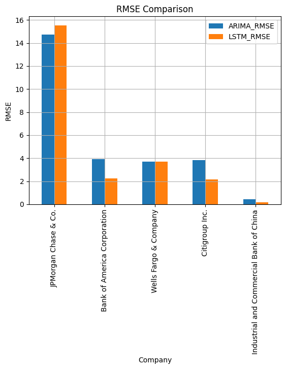
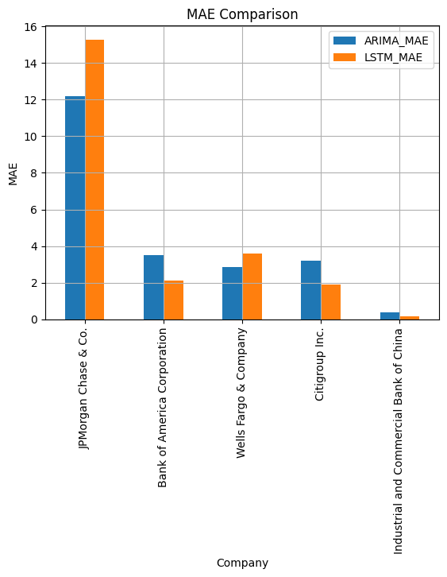

## Stock Price Prediction Using ARIMA and LSTM Models

This project aims to predict the stock prices of top financial institutions using ARIMA and LSTM models. The project includes downloading historical stock prices, training ARIMA and LSTM models, evaluating their performance, and comparing the models through visualizations and performance metrics.

### Overview

The project forecasts stock prices using two different models: ARIMA (AutoRegressive Integrated Moving Average) and LSTM (Long Short-Term Memory). It compares the performance of both models on various metrics such as RMSE, MAE, and MAPE. The stock prices of the following financial institutions are analyzed:
- JPMorgan Chase & Co. (JPM)
- Bank of America Corporation (BAC)
- Wells Fargo & Company (WFC)
- Citigroup Inc. (C)
- Industrial and Commercial Bank of China (601398.SS)

### Dependencies

To run this project, you need the following libraries:

- `yfinance`
- `pandas`
- `numpy`
- `matplotlib`
- `statsmodels`
- `sklearn`
- `tensorflow`
- `keras`

You can install these dependencies using pip:

```sh
pip install yfinance pandas numpy matplotlib statsmodels sklearn tensorflow keras
```

### Dataset
The dataset is downloaded from Yahoo Finance using the yfinance library. It includes historical stock prices from January 1, 2019, to December 31, 2023.

### ARIMA Model

#### What is ARIMA?
ARIMA stands for AutoRegressive Integrated Moving Average. It is a popular statistical method for time series forecasting that relies on past values and past forecast errors to make predictions. The model is characterized by three key parameters:

- p (AutoRegressive part): The number of lag observations included in the model (the number of terms in the autoregression).
- d (Integrated part): The number of times the raw observations are differenced to make the time series stationary.
- q (Moving Average part): The number of lagged forecast errors in the prediction equation.

#### Why Use ARIMA?
ARIMA is widely used for time series forecasting due to its simplicity and effectiveness in capturing temporal dependencies. It is particularly useful for univariate time series data where the goal is to model and predict future points based on past values.

#### ACF and PACF
What are ACF and PACF?
ACF (AutoCorrelation Function): ACF measures the correlation between the time series and its lagged values. It helps in understanding how the data points are related to each other at different lags.
PACF (Partial AutoCorrelation Function): PACF measures the correlation between the time series and its lagged values while controlling for the correlations at shorter lags. It helps in identifying the direct effect of a past value on the current value, excluding the influence of the intermediate lags.

#### Why Use ACF and PACF?
ACF and PACF plots are critical for identifying the appropriate values of p and q in the ARIMA model:

ACF Plot: Helps determine the value of q by showing how many lags of past forecast errors are useful.
PACF Plot: Helps determine the value of p by showing the number of lagged observations that are important in the autoregression.
These plots guide us in selecting the right parameters to ensure the ARIMA model is well-fitted to the data.

### LSTM Model

#### What is LSTM?
LSTM (Long Short-Term Memory) is a type of recurrent neural network (RNN) that is designed to capture both short-term and long-term dependencies in sequential data. Unlike traditional RNNs, LSTMs are capable of learning from past sequences without the problem of vanishing gradients, making them highly effective for time series forecasting.

#### Why Use LSTM?
LSTM models are particularly powerful for time series forecasting because they can capture complex patterns and long-term dependencies that might not be evident in simpler models like ARIMA. They are well-suited for cases where the relationship between past and future values is non-linear and where there may be long-term dependencies in the data.

### Running the Code
Clone the Repository:

```sh
git clone https://github.com/yourusername/stock-price-prediction.git
cd stock-price-prediction
```
Run the Code:
Execute the script to download data, train the models, and generate the plots.
```sh
python stock_prediction.py
```
### Evaluation Metrics
The models are evaluated using the following metrics:

**Root Mean Squared Error (RMSE)**: Measures the average magnitude of the errors.
**Mean Absolute Error (MAE)**: Measures the average magnitude of the absolute errors.

### Results
The project compares the ARIMA and LSTM models based on RMSE, MAE, and MAPE. The results are visualized using bar charts for easy comparison.



### Conclusion
Given the situation where the ARIMA model is predicting a flat line (constant value) and the LSTM model is yielding lower RMSE and MAE in most cases, the LSTM model appears to be the better choice.

### Key Points:
*ARIMA Flat Line Prediction:* The flat line prediction from the ARIMA model suggests that it isn't capturing the underlying patterns in the data effectively. This might be due to improper parameter tuning, non-stationarity in the data, or the model being unsuitable for the dataset.
*LSTM Performance:* The LSTM model, designed to capture both short-term and long-term dependencies in the data, seems to be performing better with lower RMSE and MAE in most cases, as shown by the performance metrics.
Conclusion:
Given the evidence, the LSTM model is likely the better option for forecasting stock prices in your dataset. It is capturing the underlying patterns better than the ARIMA model, as shown by the performance metrics. However, it is essential to continue experimenting and validating your models. Further hyperparameter tuning for LSTM, or exploring other architectures like GRU or more advanced models, may yield even better performance. On the ARIMA side, revisiting the parameters or considering more complex models like SARIMA or hybrid models that combine ARIMA and LSTM could also be beneficial.

### License
This project is licensed under the MIT License. See the LICENSE file for details.

